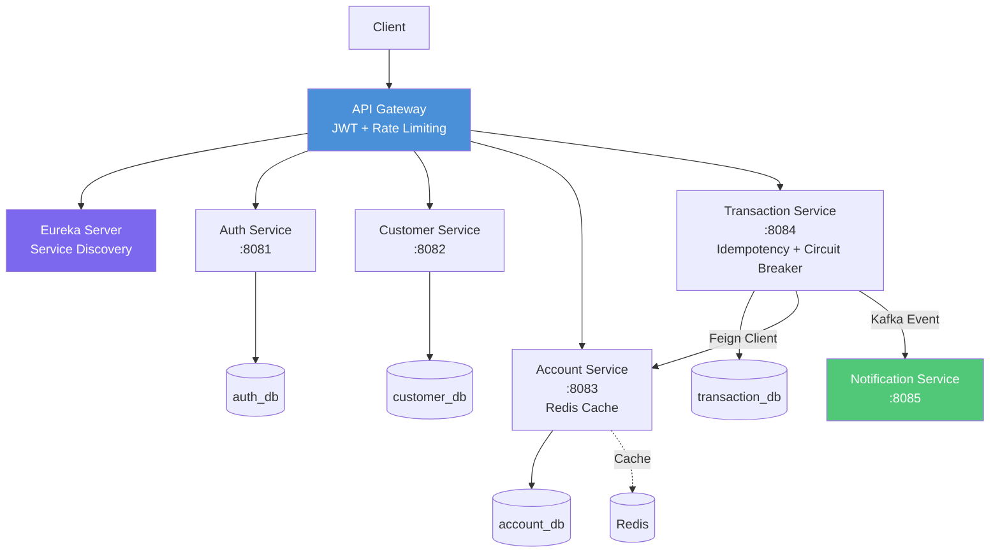

# Digital Banking Platform


Spring Boot ve Spring Cloud ile geliştirilmiş mikroservis mimarili
dijital bankacılık platformu simülasyonu.

## Mimari

Client → API Gateway (JWT doğrulama, Rate Limiting) → Eureka (Service Discovery) → İlgili Mikroservis



## Servisler

| Servis | Durum | Port | Açıklama |
|---|---|---|---|
| eureka-server | ✅ Tamamlandı | 8761 | Service Discovery |
| api-gateway | ✅ Tamamlandı | 8080 | Tek giriş noktası + JWT doğrulama + Rate Limiting + Merkezi Swagger |
| auth-service | ✅ Tamamlandı | 8081 | Kimlik doğrulama, JWT üretimi (userId/role claim'leriyle) |
| customer-service | ✅ Tamamlandı | 8082 | Müşteri yönetimi (CRUD), ownership tabanlı yetkilendirme |
| account-service | ✅ Tamamlandı | 8083 | Hesap yönetimi, atomic transfer, ownership tabanlı yetkilendirme, Redis cache |
| transaction-service | ✅ Tamamlandı | 8084 | Para transferi, Idempotency-Key, Circuit Breaker, Retry |
| notification-service | ✅ Tamamlandı | 8085 | Kafka ile asenkron bildirim |

## Çalıştırma

**Önce bir kere:** Proje kök dizininde `.env.example` dosyasını
`.env` olarak kopyala ve içindeki `JWT_SECRET` değerini kendi
belirleyeceğin, en az 32 karakterlik güçlü bir değerle doldur:

```bash
copy .env.example .env
```

(Bu adım olmadan auth-service ve api-gateway, JWT_SECRET bulamadığı
için başlamaz.)

**En kolay yol — Docker Compose ile tüm sistemi tek komutla ayağa kaldırmak:**

```bash
docker compose up -d --build
```

Bu komut, altyapıyı (PostgreSQL, Kafka, Zookeeper, Redis) ve yedi
mikroservisi hep birlikte, doğru sırayla başlatır — IntelliJ veya
Maven kurmaya gerek kalmadan. `--build` bayrağı, ilk çalıştırmada
image'ların Dockerfile'lardan sıfırdan inşa edilmesini sağlar; sonraki
çalıştırmalarda `--build` olmadan da (`docker compose up -d`) kullanılabilir.

**Güvenlik notu:** Sadece api-gateway'in portu (8080) dışarıya açıktır.
Diğer altı mikroservis yalnızca Docker network'ü içinden erişilebilir —
tüm istekler zorunlu olarak Gateway üzerinden (ve dolayısıyla JWT
kontrolünden) geçer.

**Alternatif — Her servisi elle, IntelliJ/terminal üzerinden çalıştırmak:**

1. Docker altyapısını başlat: `docker compose up -d` (sadece postgres, kafka, redis, zookeeper için de kullanılabilir)
2. Eureka Server'ı başlat: `cd eureka-server && mvnw spring-boot:run`
3. API Gateway'i başlat: `cd api-gateway && mvnw spring-boot:run`
4. Auth Service'i başlat: `cd auth-service && mvnw spring-boot:run`
5. Customer Service'i başlat: `cd customer-service && mvnw spring-boot:run`
6. Account Service'i başlat: `cd account-service && mvnw spring-boot:run`
7. Transaction Service'i başlat: `cd transaction-service && mvnw spring-boot:run`
8. Notification Service'i başlat: `cd notification-service && mvnw spring-boot:run`

## Güvenlik

Tüm istekler API Gateway üzerinden geçer. `/api/auth/register` ve
`/api/auth/login` hariç her endpoint, geçerli bir JWT token
gerektirir. Şifreler BCrypt ile hash'lenerek saklanır. Gateway
ayrıca tüm isteklere 10 saniyede 10 istek sınırı (Rate Limiting)
uygular.

**Yetkilendirme (Authorization)**: JWT token, `userId` ve `role`
bilgilerini taşır; Gateway bunları doğruladıktan sonra `X-User-Id`/
`X-User-Role` header'larıyla downstream servislere iletir. Customer
ve Account servisleri, her kayıt üzerinde sahiplik (ownership)
kontrolü yapar: bir kullanıcı sadece kendi kaydını görebilir/
değiştirebilir; ADMIN rolü her kaydı görebilir ama (bilinçli bir
tasarım kararıyla) sadece kendi kaydını değiştirebilir. Yetkisiz
erişim denemeleri `403 Forbidden` döner (bkz. docs/asama8-notlar.md,
"Gün 1 — Konu B").

## Servisler Arası İletişim

Transaction Service, Account Service'e Feign Client üzerinden
senkron HTTP çağrıları yapar (servis keşfi Eureka üzerinden).
Transaction Service, her işlem sonrası Kafka üzerinden Notification
Service'e asenkron olay (event) yayınlar.

## Atomic Transfer ve Idempotency

Para transferi, Account Service içinde tek bir `@Transactional`
veritabanı işlemi olarak gerçekleşir - sender ve receiver hesapları
aynı veritabanında olduğu için, düşüş ve artış ya birlikte başarılı
olur ya da hiçbiri gerçekleşmez. Bu, önceden (Aşama 4) bir Saga/
compensating-transaction pattern'iyle çözülüyordu; aynı veritabanına
sahip olmaları nedeniyle Aşama 8'de bu basitleştirmeye gidildi.

Her transfer isteği, istemcinin ürettiği bir `Idempotency-Key`
header'ı taşımak zorundadır - aynı key ile tekrar gönderilen bir
istek, yeni bir transfer yapmadan önceki sonucu döndürür. Bu,
ağ hatası/timeout sonrası istemcinin isteği güvenle tekrar
gönderebilmesini sağlar.

(bkz. docs/asama8-notlar.md, "Gün 2 — Konu A" ve "Gün 2 — Konu B")

## Dayanıklılık ve Performans

- **Circuit Breaker**: Account Service'e yapılan çağrılar, açıkça
  isimlendirilmiş (`accountService`) bir Resilience4j Circuit Breaker
  ile korunur - devre açıldığında (çok fazla art arda hata) çağrı
  hiç yapılmadan hızlıca reddedilir.
- **Retry**: Sadece geçici (5xx/bağlantı) hatalarda, programatik
  `RetryTemplate` ile en fazla 3 kez tekrar deneme yapılır. İş kuralı
  hataları (4xx) hiç tekrar denenmez.
- **Rate Limiter**: Gateway seviyesinde aşırı istek yüküne karşı
  koruma sağlanır.
- **Redis Cache**: Sık sorgulanan hesap verileri cache'lenir, bakiye
  değiştiğinde cache otomatik tazelenir.

(bkz. docs/asama5-notlar.md, docs/asama8-notlar.md)

## Test ve Dokümantasyon

- **Unit testler (Mockito)**: Auth, Account ve Transaction Service'te
  iş mantığının kritik senaryolarını (ownership, atomic transfer,
  idempotency dahil) kapsayan testler.
- **Integration test (Testcontainers)**: Account Service için gerçek
  bir PostgreSQL container'ında çalışan testler.
- **Swagger/OpenAPI**: Beş servisin API'si, Gateway üzerinden tek bir
  merkezi sayfada toplandı: http://localhost:8080/swagger-ui.html

(bkz. docs/asama6-notlar.md)

## DevOps

- **Docker**: Her servis, multi-stage build ile optimize edilmiş
  (165-206MB) bağımsız bir image olarak build edilebiliyor.
- **Docker Compose**: Tüm sistem (11 container — 4 altyapı + 7
  uygulama), tek bir `docker compose up -d --build` komutuyla, ortak
  bir Docker network'ü üzerinden birbirine bağlı şekilde ayağa kalkıyor.
- **GitHub Actions (CI)**: Her push'ta, yedi servisin her biri ayrı
  ayrı otomatik olarak derlenip test ediliyor (bkz. yukarıdaki badge).

(bkz. docs/asama7-notlar.md)

## Teknolojiler

Java 21, Spring Boot 3.3.4, Spring Cloud 2023.0.3, PostgreSQL 16,
Kafka, Redis, Docker, Docker Compose, GitHub Actions, JWT (jjwt),
OpenFeign, Resilience4j, Spring Retry, JUnit 5, Mockito, Testcontainers,
Springdoc OpenAPI

## Durum

✅ Proje tamamlandı — 7 mikroservis, Eureka service discovery, Gateway
üzerinden merkezi JWT doğrulama ve rate limiting, senkron (Feign) ve
asenkron (Kafka) servisler arası iletişim, Circuit Breaker/Retry ile
hata toleransı, Redis ile performans optimizasyonu, otomatik testler
(Unit + Integration), merkezi API dokümantasyonu (Swagger), Docker ile
tam konteynerleştirme ve GitHub Actions ile sürekli entegrasyon (CI).

Devam eden çalışma: bir güvenlik/mimari incelemesi sonrası tespit
edilen bulgular doğrultusunda sağlamlaştırma (hardening) çalışmaları
sürdürülüyor. Gün 1 (hızlı güvenlik düzeltmeleri + yetkilendirme) ve
Gün 2 (atomic transfer + idempotency/circuit breaker) tamamlandı,
Gün 3 devam ediyor (bkz. docs/asama8-notlar.md).