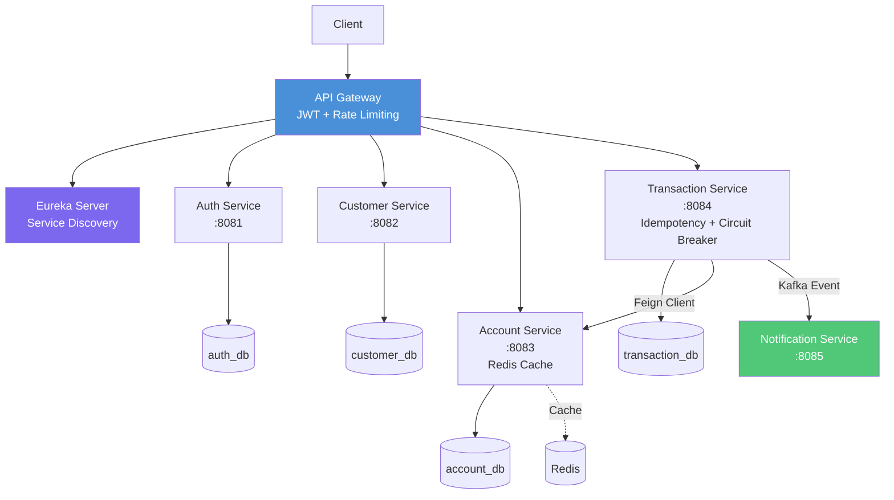

# Digital Banking Platform


Spring Boot ve Spring Cloud ile geliştirilmiş mikroservis mimarili
dijital bankacılık platformu simülasyonu.

**Öne çıkanlar**

- **Dayanıklılık, ölçülerek doğrulandı:** Circuit Breaker, Retry, TimeLimiter ve
  Idempotency-Key; gerçek bir servis kesintisinde k6 ve Grafana ile test edildi
  (bkz. "Dayanıklılık ve Performans").
- **Gözlemlenebilirlik:** Prometheus + Grafana dashboard'u, özel
  `banking_transfers_total` metriği ve Gateway'den Kafka'ya kadar tek bir
  `correlationId` ile JSON loglama.
- **Güvenlik:** Gateway'de merkezi JWT doğrulama, kısa ömürlü access token +
  refresh token (rotation, reuse tespiti, logout), ownership tabanlı yetkilendirme.
- **Tek komutla çalışır:** `docker compose up -d --build` (13 container) ve
  Postman'de tek tıkla çalışan uçtan uca senaryo (`postman/`).
- **Sınırlamalar açıkça yazılı:** bilinen eksikler gizlenmedi (bkz. "Durum").

## Mimari

Client → API Gateway (JWT doğrulama, Rate Limiting) → Eureka (Service Discovery) → İlgili Mikroservis


```mermaid
graph TD
    Client[Client] --> Gateway[API Gateway<br/>JWT + Rate Limiting]
    Gateway --> Eureka[Eureka Server<br/>Service Discovery]
    Gateway --> Auth[Auth Service<br/>:8081]
    Gateway --> Customer[Customer Service<br/>:8082]
    Gateway --> Account[Account Service<br/>:8083<br/>Redis Cache]
    Gateway --> Transaction[Transaction Service<br/>:8084<br/>Idempotency + Circuit Breaker]

    Auth --> AuthDB[(auth_db)]
    Customer --> CustomerDB[(customer_db)]
    Account --> AccountDB[(account_db)]
    Transaction --> TransactionDB[(transaction_db)]

    Transaction -->|Feign Client| Account
    Transaction -->|Kafka Event| Notification[Notification Service<br/>:8085]

    Account -.->|Cache| Redis[(Redis)]

    style Gateway fill:#4A90D9,color:#fff
    style Eureka fill:#7B68EE,color:#fff
    style Notification fill:#50C878,color:#fff
```

## Servisler

| Servis | Durum | Port | Açıklama |
|---|---|---|---|
| eureka-server | ✅ Tamamlandı | 8761 | Service Discovery |
| api-gateway | ✅ Tamamlandı | 8080 | Tek giriş noktası + JWT doğrulama + Rate Limiting + Merkezi Swagger |
| auth-service | ✅ Tamamlandı | 8081 | Kimlik doğrulama, JWT üretimi (userId/role claim'leriyle), refresh token (rotation) ve logout |
| customer-service | ✅ Tamamlandı | 8082 | Müşteri yönetimi (CRUD), ownership tabanlı yetkilendirme, sayfalama |
| account-service | ✅ Tamamlandı | 8083 | Hesap yönetimi, atomic transfer, ownership tabanlı yetkilendirme, Redis cache, sayfalama |
| transaction-service | ✅ Tamamlandı | 8084 | Para transferi, Idempotency-Key, Circuit Breaker, Retry |
| notification-service | ✅ Tamamlandı | 8085 | Kafka ile asenkron bildirim |

## Çalıştırma

**Önce bir kere:** Proje kök dizininde `.env.example` dosyasını
`.env` olarak kopyala ve içindeki `JWT_SECRET` değerini kendi
belirleyeceğin, en az 32 karakterlik güçlü bir değerle doldur:

```bash
copy .env.example .env
```

(Bu adım olmadan auth-service ve api-gateway, JWT_SECRET bulamadığı
için başlamaz.)

**En kolay yol — Docker Compose ile tüm sistemi tek komutla ayağa kaldırmak:**

```bash
docker compose up -d --build
```

Bu komut, altyapıyı (PostgreSQL, Kafka, Zookeeper, Redis), yedi
mikroservisi ve izleme araçlarını (Prometheus, Grafana) hep birlikte,
doğru sırayla başlatır — IntelliJ veya Maven kurmaya gerek kalmadan.
`--build` bayrağı, ilk çalıştırmada image'ların Dockerfile'lardan sıfırdan
inşa edilmesini sağlar; sonraki çalıştırmalarda `--build` olmadan da
(`docker compose up -d`) kullanılabilir. Altyapı servisleri (Postgres, Redis,
Zookeeper, Kafka, Eureka Server) için healthcheck tanımlıdır - uygulama
servisleri, bu servisler sadece "başlamış" değil gerçekten "hazır" (healthy)
olana kadar bekler. Servislerin Eureka'ya kaydolması 30–90 saniye sürebilir;
bu sürede ilk istekler başarısız olabilir.

**Güvenlik notu:** Uygulama tarafında sadece api-gateway'in portu (8080)
dışarıya açıktır. Diğer altı mikroservis yalnızca Docker network'ü
içinden erişilebilir — tüm istekler zorunlu olarak Gateway üzerinden (ve
dolayısıyla JWT kontrolünden) geçer. İzleme araçları (Prometheus 9090,
Grafana 3000) yalnızca yerel makineden (`127.0.0.1`) erişilebilir; servislerin
metrik portu (9100) ise host'a hiç yayımlanmaz.

**Alternatif — Her servisi elle, IntelliJ/terminal üzerinden çalıştırmak:**

1. Docker altyapısını başlat: `docker compose up -d` (sadece postgres, kafka, redis, zookeeper için de kullanılabilir)
2. Eureka Server'ı başlat: `cd eureka-server && mvnw spring-boot:run`
3. API Gateway'i başlat: `cd api-gateway && mvnw spring-boot:run`
4. Auth Service'i başlat: `cd auth-service && mvnw spring-boot:run`
5. Customer Service'i başlat: `cd customer-service && mvnw spring-boot:run`
6. Account Service'i başlat: `cd account-service && mvnw spring-boot:run`
7. Transaction Service'i başlat: `cd transaction-service && mvnw spring-boot:run`
8. Notification Service'i başlat: `cd notification-service && mvnw spring-boot:run`

## Güvenlik

Tüm istekler API Gateway üzerinden geçer. `/api/auth/register`,
`/api/auth/login`, `/api/auth/refresh` ve `/api/auth/logout` hariç her
endpoint, geçerli bir JWT token gerektirir. Şifreler BCrypt ile
hash'lenerek saklanır. Gateway ayrıca tüm isteklere 10 saniyede 10 istek
sınırı (Rate Limiting) uygular.

**Oturum yönetimi**: Login iki token verir. Access token (JWT) 15 dakika
geçerlidir; refresh token 7 gün geçerli, rastgele üretilmiş bir değerdir ve
veritabanında yalnızca hash'i saklanır. `/api/auth/refresh` her çağrıda
refresh token'ı döndürür (rotation, her token tek kullanımlık); iptal edilmiş
bir token tekrar kullanılırsa kullanıcının tüm refresh token'ları iptal edilir.
`/api/auth/logout` refresh token'ı iptal eder. Logout sonrası mevcut access
token süresi dolana kadar (en fazla 15 dakika) geçerli kalır (bkz.
docs/asama8-notlar.md, "Refresh Token ve Logout").

**Yetkilendirme (Authorization)**: JWT token, `userId` ve `role`
bilgilerini taşır; Gateway bunları doğruladıktan sonra `X-User-Id`/
`X-User-Role` header'larıyla downstream servislere iletir. Customer
ve Account servisleri, her kayıt üzerinde sahiplik (ownership)
kontrolü yapar: bir kullanıcı sadece kendi kaydını görebilir/
değiştirebilir; ADMIN rolü her kaydı görebilir ama (bilinçli bir
tasarım kararıyla) sadece kendi kaydını değiştirebilir. Yetkisiz
erişim denemeleri `403 Forbidden` döner (bkz. docs/asama8-notlar.md,
"Gün 1 — Konu B").

## Servisler Arası İletişim

Transaction Service, Account Service'e Feign Client üzerinden
senkron HTTP çağrıları yapar (servis keşfi Eureka üzerinden).
Transaction Service, her işlem sonrası Kafka üzerinden Notification
Service'e asenkron olay (event) yayınlar.

Bu servisler arası çağrılar için kullanılan `/internal/**`
endpoint'leri (örn. `account-service`'teki `internal/transfer`),
Gateway seviyesinde dışarıdan gelen isteklere tamamen kapatılmıştır -
sadece container-to-container iletişime açıktır (bkz.
docs/asama8-notlar.md, "Gün 3 — Madde 1").

## Loglama ve İzlenebilirlik

Bir istek birden fazla servisten ve bir Kafka mesajından geçtiği için,
her isteğe Gateway'de bir `X-Correlation-Id` atanır (istemci geçerli bir
değer gönderirse o korunur, yoksa UUID üretilir) ve bu kimlik tüm
servislerin loglarına yazılır: servisler arası Feign çağrılarında HTTP
header olarak, Kafka event'inde mesaj header'ı olarak taşınır. Docker
profilinde loglar JSON formatındadır ve `correlationId` ayrı bir alandır;
böylece bir transfer, Gateway → transaction → account → notification
zinciri boyunca tek bir kimlikle izlenebilir:

```bash
docker logs banking-account-service 2>&1 | findstr <correlationId>
```

(bkz. docs/asama8-notlar.md, "Yapılandırılmış Loglama ve correlationId").

## Metrikler ve İzleme

Yedi servis de Micrometer ile Prometheus formatında metrik yayınlar.
Metrikler uygulama portundan değil, ayrı bir yönetim portundan (9100)
sunulur; bu port host'a açılmaz, yalnızca Docker network'ü içinden
Prometheus erişir. `docker compose up -d --build` ile Prometheus ve
Grafana da otomatik ayağa kalkar:

| Araç | Adres | Not |
|---|---|---|
| Prometheus | http://localhost:9090 | Yalnızca yerel makineden, 15 sn'de bir okur, 7 gün saklar |
| Grafana | http://localhost:3000 | Yalnızca yerel makineden, kullanıcı `admin` |

Grafana'ya girince **Dashboards → Banking → "Banking Platform - Genel
Bakış"** açılır. Veri kaynağı ve dashboard dosyadan otomatik yüklenir
(`docker/grafana/`), elle ayar gerekmez. Dashboard: ayakta servis sayısı,
servis bazında istek hızı ve gecikme, rate limiter (HTTP 429), circuit
breaker durumu ve çağrı sonuçları, TimeLimiter zaman aşımları, JVM/CPU ve
transfer sonuçları (`banking_transfers_total` özel metriği: tamamlanan /
başarısız, nedenine göre).

Grafana parolası varsayılan olarak `admin`'dir ve servis yalnızca
localhost'a bağlıdır. Ortak bir makinede çalıştırılacaksa `.env` içine
`GRAFANA_ADMIN_PASSWORD=<güçlü parola>` eklenmelidir (isteğe bağlı).

(bkz. docs/asama8-notlar.md, "Metrikler ve İzleme (Prometheus + Grafana)").

## Atomic Transfer ve Idempotency

Para transferi, Account Service içinde tek bir `@Transactional`
veritabanı işlemi olarak gerçekleşir - sender ve receiver hesapları
aynı veritabanında olduğu için, düşüş ve artış ya birlikte başarılı
olur ya da hiçbiri gerçekleşmez. Bu, önceden (Aşama 4) bir Saga/
compensating-transaction pattern'iyle çözülüyordu; aynı veritabanına
sahip olmaları nedeniyle Aşama 8'de bu basitleştirmeye gidildi.

Her transfer isteği, istemcinin ürettiği bir `Idempotency-Key`
header'ı taşımak zorundadır - aynı key ile tekrar gönderilen bir
istek, yeni bir transfer yapmadan önceki sonucu döndürür. Bu,
ağ hatası/timeout sonrası istemcinin isteği güvenle tekrar
gönderebilmesini sağlar. Key'ler kullanıcı bazında (per-user)
benzersizdir - iki farklı kullanıcı aynı key değerini bağımsız
olarak kullanabilir; aynı kullanıcı aynı key'i farklı bir transfer
için tekrar kullanmaya çalışırsa (gövde uyuşmuyorsa) istek
`409 Conflict` ile reddedilir.

(bkz. docs/asama8-notlar.md, "Gün 2 — Konu A", "Gün 2 — Konu B" ve
"Gün 3 — Madde 2/3")

## Dayanıklılık ve Performans

- **Circuit Breaker**: Account Service'e yapılan çağrılar (Transaction
  Service içinden) ve Customer Service'e yapılan çağrılar (Account
  Service içinden, hesap açılırken), her biri açıkça isimlendirilmiş
  (`accountService`, `customerService`) ayrı birer Resilience4j Circuit
  Breaker ile korunur - devre açıldığında (çok fazla art arda hata)
  çağrı hiç yapılmadan hızlıca reddedilir. İş kuralı hataları (4xx,
  örn. yetersiz bakiye veya müşteri bulunamadı) bu istatistiğe hiç
  sayılmaz, sadece gerçek altyapı arızaları (5xx/bağlantı sorunu) sayılır.
- **Retry**: Sadece geçici (5xx/bağlantı) hatalarda, programatik
  `RetryTemplate` ile en fazla 3 kez tekrar deneme yapılır. İş kuralı
  hataları (4xx) hiç tekrar denenmez.
- **Zaman aşımı (TimeLimiter)**: Account ve Customer Service çağrıları
  için 5 saniyelik zaman aşımı açıkça tanımlıdır. Yapılandırılmadığında
  Resilience4J'nin varsayılanı olan 1 saniye, soğuk başlayan bir serviste
  işlem tamamlanmışken kaydın `FAILED` yazılmasına yol açıyordu (bkz.
  docs/asama8-notlar.md, "TimeLimiter bulgusu").
- **Optimistic Locking**: Account entity'sinde `@Version` alanıyla
  korunan hesaplarda, iki eşzamanlı işlem çakıştığında geç kalan işlem
  sessizce üzerine yazmak yerine `409 Conflict` ile reddedilir.
- **Rate Limiter**: Gateway seviyesinde aşırı istek yüküne karşı
  koruma sağlanır.
- **Redis Cache**: Sık sorgulanan hesap verileri cache'lenir, bakiye
  değiştiğinde cache otomatik tazelenir.
- **Sayfalama**: Müşteri ve hesap listeleme endpoint'leri (`GET
  /api/customers`, `GET /api/accounts`), DB'deki tüm kayıtları tek
  seferde dönmek yerine sayfalanmış sonuç döner - filtreleme de artık
  DB seviyesinde yapılıyor.

(bkz. docs/asama5-notlar.md, docs/asama8-notlar.md)

## Test ve Dokümantasyon

- **Unit testler (Mockito)**: Auth, Account ve Transaction Service'te
  iş mantığının kritik senaryolarını (ownership, atomic transfer,
  idempotency, refresh token rotation ve reuse tespiti dahil) kapsayan
  testler; Gateway'de JWT filtresinin hangi yolların açık, hangilerinin
  korumalı olduğunu doğrulayan testler.
- **correlationId testleri**: Her serviste filtre/interceptor için,
  Kafka tarafında producer ve consumer için birim testleri (id üretimi,
  şüpheli değerin reddedilmesi, MDC'nin istek sonunda temizlenmesi).
- **Integration test (Testcontainers)**: Account Service için gerçek
  bir PostgreSQL container'ında çalışan testler.
- **Postman koleksiyonu**: `postman/` klasöründe, Gateway üzerinden uçtan uca
  çalışan hazır bir koleksiyon (kayıt, giriş, müşteri, hesap, transfer,
  refresh token ve logout; 17 istek, 32 otomatik test). Postman'e aktarıp
  "Run collection" ile tek tıkla çalıştırılabilir (bkz. postman/README.md).
- **Swagger/OpenAPI**: Beş servisin API'si, Gateway üzerinden tek bir
  merkezi sayfada toplandı: http://localhost:8080/swagger-ui.html
- **Yük testi (k6)**: Gateway üzerinden uçtan uca çalışan iki senaryo:
  tek kullanıcılı taban çizgisi testi (48 transferin tamamı `COMPLETED`,
  transfer p95 ≈ 70 ms) ve Account Service'in test sırasında bilerek
  durdurulduğu bir kesinti senaryosu (Circuit Breaker'ın CLOSED → OPEN →
  HALF-OPEN → kurtarma döngüsünün zaman damgalı kaydı). Bu testler tek
  sanal kullanıcıyla çalışır, gerçek bir eşzamanlı kapasite testi değildir
  (bkz. load-tests/README.md ve docs/asama8-notlar.md, "Yük Testi (k6)").
  (bkz. docs/asama6-notlar.md)

## DevOps

- **Docker**: Her servis, multi-stage build ile optimize edilmiş
  (165-206MB) bağımsız bir image olarak build edilebiliyor.
- **Docker Compose**: Tüm sistem (13 container — 4 altyapı + 7
  uygulama + Prometheus ve Grafana), tek bir `docker compose up -d --build`
  komutuyla, ortak bir Docker network'ü üzerinden birbirine bağlı şekilde
  ayağa kalkıyor. Altyapı servisleri (Eureka Server dahil) için healthcheck
  tanımlı, uygulama servisleri bunların gerçekten hazır olmasını bekliyor.
- **GitHub Actions (CI)**: Her push'ta, yedi servisin her biri ayrı
  ayrı otomatik olarak derlenip test ediliyor (bkz. yukarıdaki badge).

(bkz. docs/asama7-notlar.md, docs/asama8-notlar.md)

## Teknolojiler

Java 21, Spring Boot 3.3.4, Spring Cloud 2023.0.3, PostgreSQL 16,
Kafka, Redis, Docker, Docker Compose, GitHub Actions, JWT (jjwt),
OpenFeign, Resilience4j, Spring Retry, JUnit 5, Mockito, Testcontainers,
Springdoc OpenAPI, k6, SLF4J MDC, Logstash Logback Encoder (JSON log),
Micrometer, Prometheus, Grafana

## Durum

✅ Proje tamamlandı. Bir güvenlik/mimari incelemesi sonrası tespit edilen
bulgular doğrultusunda yapılan sağlamlaştırma (hardening) turları da bitti.

**Tamamlananlar**

- 7 mikroservis, Eureka service discovery, Gateway üzerinden merkezi JWT
  doğrulama ve rate limiting.
- Senkron (Feign) ve asenkron (Kafka) servisler arası iletişim.
- Circuit Breaker, Retry, TimeLimiter, Idempotency-Key ve optimistic locking
  ile hata toleransı ve tutarlılık.
- Redis ile performans optimizasyonu, sayfalama.
- Refresh token (rotation, reuse tespiti) ve logout.
- Yapılandırılmış JSON loglama ve servisler arası `correlationId`.
- Prometheus + Grafana ile metrik izleme, özel transfer metriği.
- k6 ile yük/dayanıklılık testleri, Postman ile uçtan uca senaryo.
- Otomatik testler (Unit + Integration), Swagger, Docker/Docker Compose ve
  GitHub Actions ile CI.

**Bilinen sınırlamalar**

- Logout sonrası mevcut access token, süresi dolana kadar (en fazla 15 dakika)
  geçerli kalır; JWT kara listesi (örn. Redis) yok.
- Aynı refresh token ile eşzamanlı gelen iki yenileme isteği için satır kilidi
  yok; süresi dolmuş/iptal edilmiş token kayıtları için temizlik işi yok.
- Zaman aşımı süresi aşılırsa Account Service işi tamamlasa bile transfer kaydı
  `FAILED` kalabilir; belirsiz sonuçlar için mutabakat (reconciliation) adımı
  yok.
- Yük testleri tek sanal kullanıcıyla çalışır, gerçek bir eşzamanlı kapasite
  testi değildir.
- Grafana'da p95 gecikme (histogram) ve uyarı (alert) kuralları yok.
- `ADMIN` rolü self-servis atanamaz, veritabanında elle verilir.

Ayrıntılı geliştirme geçmişi, bulgular ve gerekçeler için bkz.
`docs/asama5-notlar.md` ... `docs/asama8-notlar.md`.